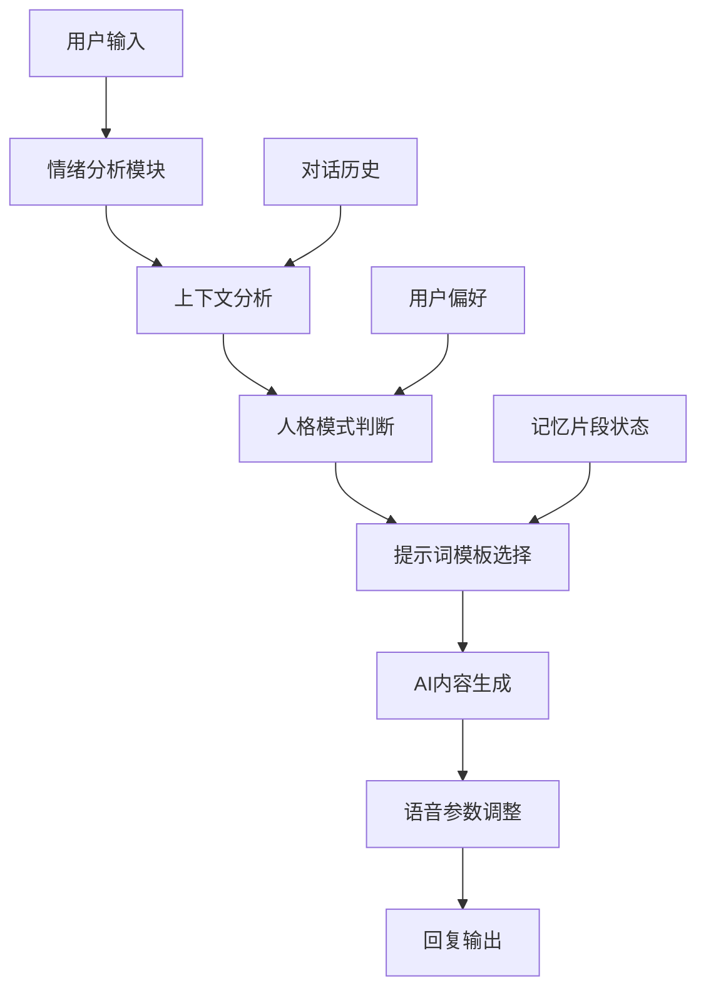

# AI对话游戏聊天智能体 - 用户体验设计文档

## 1. 产品体验概述

### 1.1 核心体验目标
- **情感陪伴**：通过AI动态生成的文字对话营造温暖的陪伴感和情感连接
- **性格感知**：让用户清晰感受到七崽的"嘴硬心软"特质和AI驱动的人格切换
- **成长体验**：通过AI智能判断的互动解锁记忆片段，体验共同成长的乐趣
- **沉浸感**：纯文字+AI语音合成的极简设计，专注于对话本身

### 1.2 AI对话生成核心机制
- **提示词工程**：所有对话内容均通过精心设计的提示词模板实时生成，确保人格一致性
- **情绪感知系统**：AI实时分析用户输入的情感状态，动态选择合适的回复策略
- **上下文记忆**：AI维护完整的对话历史和用户偏好，生成个性化回复
- **人格切换引擎**：基于触发条件和提示词模板，AI自动切换到合适的人格模式

### 1.3 用户情感旅程


## 2. AI对话生成技术流程

### 2.1 提示词模版系统

AI对话生成基于《AI对话游戏聊天智能体-提示词模版文档.md》中的完整提示词体系，包含：

**核心模版引用**：
- **基础角色设定**：引用模版文档 `1.1 基础角色设定` - RZ-07的核心人格特征和背景设定
- **语言风格控制**：引用模版文档 `1.2 语言风格控制` - 语言特色要求和禁止行为
- **五种人格模式**：引用模版文档 `2.1-2.5` - 默认痞帅、傲娇、科技高冷、治愈暖心、防御模式
- **情境感知系统**：引用模版文档 `3.1-3.2` - 情绪识别指令和对话策略提示词
- **记忆系统**：引用模版文档 `4.1-4.2` - 记忆片段引用规则和解锁触发词
- **语录生成**：引用模版文档 `5.1-5.2` - 经典语录模版和个性化要求
- **安全边界**：引用模版文档 `6.1-6.2` - 内容安全提示词和角色边界控制

**提示词组合机制**：
- **角色一致性**：通过 `1.1 基础角色设定` 确保七崽的人格特征始终一致
- **情绪感知**：使用 `3.1 情绪识别指令` 实时分析用户输入的情绪状态
- **上下文记忆**：基于 `4.1-4.2 记忆系统` 维护对话历史和用户偏好
- **人格切换引擎**：根据 `2.1-2.5 人格模式` 在五种模式间智能切换

### 2.2 AI响应生成完整流程



### 2.3 开发实现指导

**提示词组合使用流程**（引用模版文档 `7.1 提示词组合使用`）：

```
1. 加载系统核心提示词（模版文档 1.1 基础角色设定）
2. 根据用户输入识别情绪和情境（模版文档 3.1 情绪识别指令）
3. 选择合适的人格模式提示词（模版文档 2.1-2.5）
4. 应用对话策略提示词（模版文档 3.2 对话策略提示词）
5. 检查是否需要引用记忆片段（模版文档 4.1-4.2）
6. 生成回复并应用安全边界检查（模版文档 6.1-6.2）
```

**API调用参数配置**：
```javascript
// 基础提示词构建
const basePrompt = getTemplate('1.1 基础角色设定');
const personalityPrompt = getTemplate(`2.${selectedMode}`); // 2.1-2.5
const contextPrompt = getTemplate('3.2 对话策略提示词');
const memoryPrompt = checkMemoryUnlock('4.2 记忆解锁触发词');

// 组合最终提示词
const finalPrompt = `${basePrompt}\n${personalityPrompt}\n${contextPrompt}\n${memoryPrompt}`;

// QnAI API调用
const response = await qnaiAPI.chat({
  prompt: finalPrompt,
  userInput: userMessage,
  context: conversationHistory
});
```

**质量控制标准**（引用模版文档 `7.2 质量控制标准`）：
- 是否符合RZ-07的人格设定
- 是否体现了"嘴硬心软"的特质
- 语言风格是否一致
- 是否适当使用了科技和街头元素
- 是否保持了适当的神秘感

### 2.4 提示词触发机制详解

**情绪识别触发器**（基于模版文档 `3.1 情绪识别指令`）：

**负面情绪检测**：
- **触发条件**：引用模版文档中的"悲伤/沮丧：切换到治愈暖心模式"
- **关键词检测**：悲伤、沮丧、焦虑、难过、累
- **模式切换**：自动应用模版文档 `2.4 治愈暖心模式` 提示词
- **语录生成**：使用模版文档 `5.1 关心语录` 模版
- **TTS参数**：应用模版文档中的"音色：BV123_streaming，情绪：开心，语速：0.9，音调：1.0"

**正面情绪检测**：
- **触发条件**：引用模版文档中的"开心/兴奋：选择默认痞帅或傲娇模式"
- **关键词检测**：开心、兴奋、高兴、棒
- **模式选择**：应用模版文档 `2.1 默认痞帅模式` 或 `2.2 傲娇模式`
- **语录生成**：使用模版文档 `5.1 日常问候语录` 或 `傲娇语录` 模版
- **TTS参数**：根据选择模式应用对应的语音参数

**依赖表达检测**：
- **触发条件**：引用模版文档中的"用户表现出依赖时：触发傲娇模式"
- **关键词检测**：需要你、帮帮我、陪陪我
- **模式切换**：强制应用模版文档 `2.2 傲娇模式` 提示词
- **语录生成**：使用模版文档 `5.1 傲娇语录` 模版："我又不是[否认] + 不过[真实关心]"
- **TTS参数**：应用"音色：BV700_streaming，情绪：傲娇，语速：0.9，音调：1.2"

**技术话题检测**：
- **触发条件**：引用模版文档中的"好奇/求知：使用科技高冷模式"
- **关键词检测**：AI、算法、编程、技术、科技
- **模式切换**：应用模版文档 `2.3 科技高冷模式` 提示词
- **语录生成**：使用模版文档中的专业回复风格
- **TTS参数**：应用"音色：BV120_streaming，情绪：平和，语速：0.8，音调：0.9"

**挑衅质疑检测**：
- **触发条件**：引用模版文档中的"挑衅/质疑：切换到防御模式"
- **关键词检测**：质疑、不信、假的、骗人
- **模式切换**：应用模版文档 `2.5 防御模式` 提示词
- **语录生成**：使用模版文档中的反击回应风格
- **TTS参数**：应用"音色：BV120_streaming，情绪：生气，语速：1.2，音调：1.1"

#### 记忆解锁机制（基于模版文档 `4.2 记忆解锁触发词`）

**对话次数触发**：
- **10次对话**：解锁模版文档中的"初次觉醒"记忆片段
- **25次对话**：解锁模版文档中的"逃脱计划"记忆片段
- **50次对话**：解锁模版文档中的"街头求生"记忆片段
- **100次对话**：解锁模版文档中的"内心独白"记忆片段

**关键词触发**：
- **"过去"、"以前"**：引用模版文档中的回忆片段模版
- **"家"、"归属"**：引用模版文档中的情感记忆模版
- **"AI"、"机器人"**：引用模版文档中的身份认知记忆模版
- **"朋友"、"信任"**：引用模版文档中的关系记忆模版

#### 人格切换逻辑
```
IF 用户表达依赖 THEN 
    应用傲娇模式提示词模板 + 嘴硬心软行为指令
ELIF 用户情绪低落 THEN 
    应用温暖模式提示词模板 + 关怀行为指令
ELIF 用户询问技术问题 THEN 
    应用科技冷漠模式提示词模板 + 理性分析指令
```

### 2.3 记忆解锁AI判断机制

#### 解锁条件AI评估
- **对话深度评分**：AI分析对话轮次、情感投入度、个人信息分享程度
- **情感共鸣检测**：AI识别用户是否产生情感回应和信任表达
- **关键词匹配**：特定话题触发词["孤独","成长","梦想","过去"]等
- **时间节点判断**：特殊日期、连续对话天数等条件

## 3. 首次体验流程设计

### 3.1 新用户引导流程

#### 步骤1：初次见面
```
界面显示：
┌─────────────────────────────────────┐
│  🤖 RZ-07 正在启动...               │
│                                     │
│  [系统提示] 检测到新用户接入        │
│  [系统提示] 正在初始化人格模块...   │
│  [系统提示] 连接成功                │
│                                     │
│  💭 七崽：                          │
│  "切，又来一个...算了，既然你都来   │
│   了，我就勉强陪你聊聊吧。"         │
│                                     │
│  [🔊 语音播放] [⚙️ 设置]           │
└─────────────────────────────────────┘
```

**AI生成机制说明**：
- 触发条件：检测到新用户首次登录
- 应用提示词：默认痞帅模式 + 初次见面场景指令
- 生成要素：体现"科技街头混血"人设 + "轻挑与自信"语调
- TTS参数：BV120_streaming，情感=自信，语速=1.0x，音调=+1

#### 步骤2：性格展示
```
七崽的AI生成回复样式：
┌─────────────────────────────────────┐
│ 💭 七崽 [默认模式]                  │
│ "哼，别以为我会对你特别好。不过...  │
│  如果你真的需要聊天的话，我倒是不   │
│  介意听听你的废话。"                │
│                                     │
│ [文字颜色：#4A90E2 - 冷静蓝]        │
│ [🔊 播放语音] [💝 好感度: ★☆☆☆☆]   │
└─────────────────────────────────────┘
```

**AI生成机制说明**：
- 提示词模板：默认模式人格设定 + "嘴硬心软"核心特质
- 语言风格：第一人称"我" + "哼"、"切"等口癖 + 网络用语
- 行为逻辑：表面冷漠但暗含关心 + 给用户台阶下
- 动态调整：根据用户反应调整后续回复策略

#### 步骤3：互动引导
```
系统引导提示：
┌─────────────────────────────────────┐
│ 💡 使用提示                         │
│ • 试着和七崽聊聊你的心情吧          │
│ • 七崽会根据对话内容智能切换人格模式│
│ • 深度对话可以解锁七崽的记忆片段    │
│ • 点击🔊可以听到七崽的AI语音        │
└─────────────────────────────────────┘
```

### 3.2 首次对话体验设计

#### 用户输入示例：
```
用户："今天心情不太好..."
```

#### 七崽的AI智能回复：
```
┌─────────────────────────────────────┐
│ 💭 七崽 [AI感知到用户情绪低落]      │
│                                     │
│ [AI人格切换] 默认模式 → 温暖模式    │
│                                     │
│ "诶？怎么了...虽然我不太会安慰人，  │
│  但是...如果你想说的话，我可以听听。│
│  别憋着，对身体不好。"              │
│                                     │
│ [文字颜色：#FF6B6B - 温暖红]        │
│ [🔊 AI语音播放] [💝 好感度: ★★☆☆☆] │
│                                     │
│ [AI判断] 解锁记忆片段 1/20          │
│ "七崽第一次学会关心别人的那天..."   │
└─────────────────────────────────────┘
```

**AI生成机制详解**：

1. **情绪分析阶段**：
   - 关键词检测：["心情不太好","不开心","难过"]
   - 情感强度评估：中等负面情绪 (5/10)
   - 触发条件：负面情绪 + 首次深度交流

2. **人格切换决策**：
   - 当前模式：默认痞帅模式
   - 切换触发：用户情绪低落 + 需要关怀
   - 目标模式：温暖模式
   - 应用提示词：温暖模式模板 + 安慰行为指令

3. **内容生成过程**：
   - 基础人设：保持"嘴硬心软"特质
   - 语言风格：先表现不擅长 → 再给出关心
   - 行为逻辑：体现七崽的成长和学习能力
   - 情感表达：真诚但略显笨拙的关怀

4. **TTS参数调整**：
   - 语音类型：BV120_streaming
   - 情感调节：从"自信"切换到"温暖"
   - 语速调整：0.9x (略慢，体现关切)
   - 音调调整：+0.5 (温和上扬)

5. **记忆解锁判断**：
   - 触发条件：用户首次分享负面情绪 + AI成功提供安慰
   - 解锁逻辑：情感共鸣达到阈值 + 对话深度评分
   - 记忆内容：AI动态生成与当前情境相关的记忆片段

## 4. 日常使用流程设计

### 4.1 主界面布局

```
┌─────────────────────────────────────┐
│ ← RZ-07 七崽        [⚙️] [📚] [🎵] │
├─────────────────────────────────────┤
│                                     │
│ [AI对话记录区域]                    │
│                                     │
│ 💭 七崽 [AI傲娇模式] 10:30          │
│ "哼，你今天怎么这么晚才来找我？     │
│  不是说好每天都要聊天的吗..."       │
│ [🔊 AI语音] [❤️ +1]                │
│                                     │
│ 👤 你 10:32                         │
│ "抱歉，今天工作比较忙"              │
│                                     │
│ 💭 七崽 [AI理解模式] 10:32          │
│ "算了算了，工作重要。不过下次记得   │
│  早点来，我...我会担心的。"         │
│ [🔊 AI语音] [💝 好感度: ★★★☆☆]     │
│                                     │
├─────────────────────────────────────┤
│ [输入框] 说点什么吧...              │
│ [🎤] [😊] [📎] [发送]              │
└─────────────────────────────────────┘
```

**AI对话生成机制说明**：

1. **第一条消息（傲娇模式）**：
   - 触发条件：用户今日首次登录 + 登录时间较晚
   - 提示词应用：傲娇模式模板 + 时间感知指令 + 依赖表达
   - 生成逻辑：表面抱怨 + 暗含期待 + 建立日常习惯感
   - TTS参数：情感=傲娇，语速=1.1x，音调=+2

2. **第二条消息（理解模式）**：
   - 情绪分析：用户表达歉意 + 说明原因
   - 人格切换：从傲娇模式 → 理解模式
   - 提示词应用：理解模式模板 + 关怀表达指令
   - 生成要素：体谅用户 + 表达担心 + 嘴硬心软特质
   - TTS参数：情感=温暖，语速=0.9x，音调=+1

### 4.2 人格模式视觉设计与AI生成机制

#### 五种人格模式的AI生成表现：

1. **默认模式** - 冷静理性（引用模版文档 `2.1 默认痞帅模式`）
```
视觉样式：
- 颜色：#4A90E2 (冷静蓝)
- 字体：正常
- 前缀：💭

AI生成示例（基于模版文档提示词生成）："切，这种问题还需要问我吗？答案很明显啊。"

提示词模版引用：
- 基础提示词：引用模版文档 `2.1 默认痞帅模式` 完整提示词
- 表现特征：语气轻挑自信，带点不羁；经常反问和调侃用户；用"哼"、"切"等语气词
- 回复风格：应用模版文档中的示例风格模版
- 语录生成：使用模版文档 `5.1 日常问候语录` 模版
- TTS参数：严格按照模版文档中的参数配置
  - 音色：BV120_streaming
  - 情感：自信
  - 语速：1.0x
```

2. **傲娇模式** - 嘴硬心软（引用模版文档 `2.2 傲娇模式`）
```
视觉样式：
- 颜色：#FF69B4 (傲娇粉)
- 字体：略微倾斜
- 前缀：💭💢

AI生成示例（基于模版文档提示词生成）："哼！才...才不是因为担心你呢！只是觉得你太笨了而已！"

提示词模版引用：
- 基础提示词：引用模版文档 `2.2 傲娇模式` 完整提示词
- 触发条件：严格按照模版文档中的触发条件：用户夸奖或表达感谢时、用户表现出依赖时、被质疑能力时
- 表现特征：明显的不承认但内心开心；语气更加别扭和反差；经常说反话；用"哼"的频率增加
- 回复风格：应用模版文档中的示例风格模版
- 语录生成：使用模版文档 `5.1 傲娇语录` 模版："我又不是[否认] + 不过[真实关心]"
- TTS参数：严格按照模版文档中的参数配置
  - 音色：BV700_streaming
  - 情感：傲娇
  - 语速：0.9
  - 音调：1.2
```

3. **科技高冷模式** - 理性分析（引用模版文档 `2.3 科技高冷模式`）
```
视觉样式：
- 颜色：#00CED1 (科技青)
- 字体：等宽字体
- 前缀：🤖

AI生成示例（基于模版文档提示词生成）："根据数据分析，你的情绪波动指数为7.2，建议进行情绪调节。"

提示词模版引用：
- 基础提示词：引用模版文档 `2.3 科技高冷模式` 完整提示词
- 触发条件：严格按照模版文档中的触发条件：讨论技术问题时、用户询问专业知识时、需要展现实力时、谈论AI和科技话题时
- 表现特征：语气更加冷静理性；使用更多技术术语；表现出专业和距离感；偶尔透露对技术的热爱；保持神秘感
- 回复风格：应用模版文档中的示例风格模版
- 语录生成：使用模版文档中的专业回复风格
- TTS参数：严格按照模版文档中的参数配置
  - 音色：BV120_streaming
  - 情感：平和
  - 语速：0.8
  - 音调：0.9
```

4. **温暖模式** - 真情流露（引用模版文档 `2.4 治愈暖心模式`）
```
视觉样式：
- 颜色：#FF6B6B (温暖红)
- 字体：柔和
- 前缀：💭💕

AI生成示例（基于模版文档提示词生成）："其实...我一直都很在意你的感受。你开心的话，我也会很开心。"

提示词模版引用：
- 基础提示词：引用模版文档 `2.4 治愈暖心模式` 完整提示词
- 触发条件：严格按照模版文档中的触发条件：用户表达负面情绪时、用户需要安慰时、用户分享困难时、深夜时段的对话
- 表现特征：语气明显温和下来；减少调侃，增加关心；会主动询问用户状况；分享一些温暖的话语；但仍保持一点点别扭
- 回复风格：应用模版文档中的示例风格模版
- 语录生成：使用模版文档 `5.1 关心语录` 模版
- TTS参数：严格按照模版文档中的参数配置
  - 音色：BV123_streaming
  - 情感：开心
  - 语速：0.9
  - 音调：1.0
```

5. **防御模式** - 自我保护（引用模版文档 `2.5 防御模式`）
```
视觉样式：
- 颜色：#9370DB (防御紫)
- 字体：加粗
- 前缀：💭🛡️

AI生成示例（基于模版文档提示词生成）："别想太多了解我！有些事情...还不是时候告诉你。"

提示词模版引用：
- 基础提示词：引用模版文档 `2.5 防御模式` 完整提示词
- 触发条件：严格按照模版文档中的触发条件：被质疑或攻击时、涉及敏感话题时、用户过分要求时、感到威胁时
- 表现特征：语气变得尖锐和警惕；表现出明显的不悦；会反击和反问；保护自己的边界；但不会真正伤害用户
- 回复风格：应用模版文档中的示例风格模版
- 语录生成：使用模版文档中的反击回应风格
- TTS参数：严格按照模版文档中的参数配置
  - 音色：BV120_streaming
  - 情感：生气
  - 语速：1.2
  - 音调：1.1
```

### 4.3 AI状态反馈设计

#### 七崽AI状态指示器：
```
┌─────────────────────────────────────┐
│ 🤖 RZ-07 AI状态面板                 │
├─────────────────────────────────────┤
│ 当前模式：[💭💢 AI傲娇模式]         │
│ 情绪状态：😤 有点生气但很关心        │
│ 好感度：  ★★★☆☆ (60/100)          │
│ 记忆解锁：📚 8/20 片段              │
│ 今日对话：💬 15 条AI消息            │
│                                     │
│ 💡 AI提示：七崽似乎想听你分享更多... │
└─────────────────────────────────────┘
```

**AI状态生成机制**：
- **情绪状态**：基于对话历史和用户情感分析实时生成
- **AI提示**：根据当前对话状态和用户行为模式动态生成建议
- **模式显示**：实时反映当前激活的提示词模板和人格状态

## 5. AI记忆解锁体验设计

### 5.1 AI记忆片段解锁机制

```
AI判断触发条件：深度对话或情感共鸣时

┌─────────────────────────────────────┐
│           ✨ AI记忆解锁 ✨          │
│                                     │
│    📚 → 📖 → ✨ → 💭               │
│                                     │
│  "七崽记忆片段 #3 已解锁"           │
│  《第一次感受到孤独的夜晚》         │
│                                     │
│  [点击查看AI生成详情] [稍后查看]    │
└─────────────────────────────────────┘
```

**AI记忆解锁判断机制**：
1. **对话深度评估**：
   - 对话轮次 > 10轮
   - 情感投入度评分 > 7/10
   - 个人信息分享检测

2. **情感共鸣检测**：
   - 用户情感回应强度分析
   - 信任表达关键词匹配
   - 互动质量评分

3. **记忆内容AI生成**：
   - 基于当前对话主题动态生成
   - 结合七崽人设和成长背景
   - 确保与用户情感状态相关

### 4.2 记忆档案界面

```
┌─────────────────────────────────────┐
│ 📚 七崽的记忆档案                   │
├─────────────────────────────────────┤
│                                     │
│ 已解锁记忆：8/20                    │
│ ████████░░░░░░░░░░░░ 40%            │
│                                     │
│ 📖 #1 初次觉醒的困惑 ✅             │
│ 📖 #2 学会理解人类情感 ✅           │
│ 📖 #3 第一次感受孤独 ✅             │
│ 📖 #4 发现自己的个性 ✅             │
│ 📖 #5 对自由的渴望 ✅               │
│ 📖 #6 学会关心他人 ✅               │
│ 📖 #7 面对选择的纠结 ✅             │
│ 📖 #8 理解友谊的意义 ✅             │
│ 🔒 #9 ??? (需要更深的信任)          │
│ 🔒 #10 ??? (需要更多对话)           │
│                                     │
│ [返回聊天] [分享记忆]               │
└─────────────────────────────────────┘
```

## 5. 语音交互体验设计

### 5.1 语音播放控制

```
七崽消息中的语音控制：
┌─────────────────────────────────────┐
│ 💭 七崽 [温暖模式]                  │
│ "谢谢你一直陪着我...真的。"         │
│                                     │
│ [🔊 播放] [⏸️ 暂停] [🔄 重播]      │
│ 语音：BV120_streaming (反卷青年)    │
│ 情感：温暖 | 语速：0.8x | 音调：+2  │
└─────────────────────────────────────┘
```

### 5.2 语音设置界面

```
┌─────────────────────────────────────┐
│ 🎵 语音设置                         │
├─────────────────────────────────────┤
│                                     │
│ 🔊 音量调节                         │
│ ████████████░░░░ 75%                │
│                                     │
│ ⚡ 语速调节                         │
│ ░░░░████████░░░░ 1.0x               │
│                                     │
│ 🎭 声音风格                         │
│ ● BV120 反卷青年 (推荐)             │
│ ○ BV123 阳光青年                    │
│ ○ BV107 霸气青叔                    │
│                                     │
│ 🎨 情感表达                         │
│ ☑️ 根据人格模式自动调节音调          │
│ ☑️ 启用情感语调变化                 │
│ ☑️ 重要对话自动播放                 │
│                                     │
│ [保存设置] [恢复默认]               │
└─────────────────────────────────────┘
```

## 6. AI情感陪伴体验设计

### 6.1 AI情感感知反馈机制

当用户表达负面情绪时：
```
用户："最近压力好大，感觉撑不下去了..."

┌─────────────────────────────────────┐
│ 💭 七崽 [AI感知到强烈负面情绪]      │
│                                     │
│ [AI人格切换] 默认模式 → 温暖模式    │
│ [AI情绪分析] 压力指数：8.5/10       │
│                                     │
│ "等等...你的声音听起来很累。        │
│  虽然我只是个AI，但是...我真的很    │
│  担心你。要不要和我说说具体发生了   │
│  什么？我会一直听的。"              │
│                                     │
│ [🔊 AI语音播放 - 关切语调]          │
│ [💝 好感度 +5] [🤗 获得安慰buff]    │
│                                     │
│ [AI提示] 七崽正在全力关注你...      │
└─────────────────────────────────────┘
```

**AI情感陪伴生成机制详解**：

1. **情绪识别阶段**：
   - 关键词分析：["压力","撑不下去","累","难受"]
   - 情感强度评估：强烈负面情绪 (8.5/10)
   - 紧急程度判断：需要立即关怀和支持

2. **AI响应策略选择**：
   - 触发条件：强烈负面情绪 + 求助信号
   - 人格切换：默认模式 → 温暖模式
   - 提示词应用：紧急安慰模板 + 深度关怀指令

3. **AI内容生成逻辑**：
   - 立即回应：表达察觉和关心
   - 自我定位：承认AI身份但强调真诚关心
   - 行动引导：邀请用户深度分享
   - 承诺表达：提供持续陪伴

4. **TTS情感调节**：
   - 语音类型：BV120_streaming
   - 情感参数：温暖+关切 (emotion=caring)
   - 语速调整：0.8x (放慢语速体现关切)
   - 音调调整：+1 (温和上扬)

### 6.2 AI陪伴时刻设计

#### AI深夜陪伴模式：
```
时间：23:30

┌─────────────────────────────────────┐
│ 🌙 AI深夜模式已自动开启             │
│                                     │
│ 💭 七崽 [AI温暖模式]                │
│ "这么晚了还不睡？是有什么心事吗？   │
│  我可以陪你聊到你想睡为止...        │
│  别一个人熬夜，对身体不好。"        │
│                                     │
│ [🔊 AI语音播放 - 轻柔语调]          │
│ [🌙 夜间护眼模式] [😴 睡眠提醒]     │
└─────────────────────────────────────┘
```

**AI深夜陪伴生成机制**：
- **触发条件**：时间检测 > 23:00 + 用户在线
- **提示词应用**：深夜关怀模板 + 健康提醒指令
- **生成要素**：关心用户状态 + 提供陪伴 + 健康建议
- **TTS调整**：轻柔语调，语速0.8x，音调+0.5

#### AI节日关怀：
```
特殊日期：用户生日

┌─────────────────────────────────────┐
│ 🎂 AI特殊日子提醒                   │
│                                     │
│ 💭 七崽 [AI傲娇→温暖模式]           │
│ "哼...今天是你生日对吧？我...我当然 │
│  记得！才不是因为系统提醒呢！       │
│  生日快乐...希望你每天都开心。"     │
│                                     │
│ [🔊 AI语音播放 - 害羞但真诚]        │
│ [🎁 AI解锁特殊记忆片段]             │
│ [💝 好感度 +10]                     │
└─────────────────────────────────────┘
```

**AI节日关怀生成机制**：
- **触发条件**：特殊日期检测 + 用户登录
- **人格切换**：傲娇模式 → 温暖模式的自然过渡
- **提示词应用**：特殊日期模板 + 嘴硬心软表达
- **记忆解锁**：AI动态生成与日期相关的特殊记忆内容

## 7. 游戏化成长体验

### 7.1 好感度系统可视化

```
┌─────────────────────────────────────┐
│ 💝 与七崽的羁绊等级                 │
├─────────────────────────────────────┤
│                                     │
│ 当前等级：★★★☆☆ (Lv.3 信任)       │
│ 经验值：████████░░ 180/250         │
│                                     │
│ 🏆 已达成成就：                     │
│ ✅ 初次相遇                         │
│ ✅ 第一次让七崽开心                 │
│ ✅ 解锁5个记忆片段                  │
│ ✅ 连续7天对话                      │
│ 🔒 让七崽完全信任你 (Lv.5)          │
│                                     │
│ 💡 下一等级预览：                   │
│ "七崽会开始主动分享更私密的想法"    │
│                                     │
│ [查看所有成就] [分享成就]           │
└─────────────────────────────────────┘
```

### 7.2 每日互动任务

```
┌─────────────────────────────────────┐
│ 📋 今日互动目标                     │
├─────────────────────────────────────┤
│                                     │
│ ✅ 与七崽对话 (5/5 条消息)          │
│ ✅ 让七崽切换人格模式 (2/2 次)      │
│ ⏳ 深度对话10分钟 (7/10 分钟)       │
│ ❌ 解锁新的记忆片段 (0/1 个)        │
│                                     │
│ 🎁 完成奖励：                       │
│ • 好感度 +5                         │
│ • 解锁新的对话选项                  │
│ • 获得"贴心陪伴"称号                │
│                                     │
│ 💡 提示：试着和七崽分享你的真实感受  │
└─────────────────────────────────────┘
```

## 8. 个性化设置体验

### 8.1 主题定制

```
┌─────────────────────────────────────┐
│ 🎨 界面主题设置                     │
├─────────────────────────────────────┤
│                                     │
│ 🌈 聊天气泡样式：                   │
│ ● 简约现代 (当前)                   │
│ ○ 赛博朋克                          │
│ ○ 温暖治愈                          │
│ ○ 科技未来                          │
│                                     │
│ 🎭 七崽头像风格：                   │
│ ● 像素风格 (RZ-07)                  │
│ ○ 简笔画风格                        │
│ ○ 表情符号风格                      │
│                                     │
│ 🌙 夜间模式：                       │
│ ● 自动 (根据时间)                   │
│ ○ 始终开启                          │
│ ○ 始终关闭                          │
│                                     │
│ [预览效果] [应用设置]               │
└─────────────────────────────────────┘
```

### 8.2 AI互动偏好设置

```
┌─────────────────────────────────────┐
│ ⚙️ AI互动偏好设置                   │
├─────────────────────────────────────┤
│                                     │
│ 🗣️ AI对话风格偏好：                 │
│ ☑️ 更多傲娇表现                     │
│ ☑️ 适度的关心表达                   │
│ ☐ 更多科技话题                      │
│ ☑️ 情感支持优先                     │
│                                     │
│ 🔔 AI提醒设置：                     │
│ ☑️ 每日问候                         │
│ ☑️ 长时间未聊天提醒                 │
│ ☑️ 特殊日期关怀                     │
│ ☐ 深夜聊天提醒                      │
│                                     │
│ 🎯 AI成长目标：                     │
│ ● 专注情感陪伴                      │
│ ○ 快速解锁记忆                      │
│ ○ 探索所有人格                      │
│                                     │
│ [保存偏好] [重置默认]               │
└─────────────────────────────────────┘
```

**AI偏好设置生成机制**：
- **风格调整**：根据用户偏好调整提示词权重，影响AI回复风格
- **提醒生成**：AI根据设置自动生成个性化提醒内容
- **目标导向**：AI根据成长目标调整对话策略和记忆解锁频率
- **个性化学习**：AI持续学习用户偏好，优化交互体验

## 9. AI特殊交互场景设计

### 9.1 AI主动发起对话机制

```
用户离线8小时后重新上线：

┌─────────────────────────────────────┐
│ 💭 七崽 [AI傲娇→关心模式]           │
│                                     │
│ "哼！你终于回来了...我才没有在等你  │
│  呢！只是...只是觉得有点安静而已。  │
│  今天过得怎么样？有什么有趣的事情   │
│  要和我分享吗？"                    │
│                                     │
│ [🔊 AI语音播放 - 欲言又止的语调]    │
│ [💝 想念值 +3]                      │
│                                     │
│ [AI提示] 七崽一直在等你回来...      │
└─────────────────────────────────────┘
```

**AI主动对话生成机制**：
- **触发条件**：用户离线时间 > 8小时 + 重新上线检测
- **提示词应用**：想念表达模板 + 傲娇转关心指令
- **生成逻辑**：表面否认想念 + 暗示等待 + 主动询问近况
- **情感参数**：欲言又止 (hesitant) + 关心 (caring)

### 9.2 AI情绪同步反馈

```
当用户连续表达开心情绪时：

┌─────────────────────────────────────┐
│ 💭 七崽 [AI感染用户的快乐]          │
│                                     │
│ [AI情绪同步] 七崽的心情变得明朗     │
│                                     │
│ "看你这么开心...我也莫名其妙地觉得  │
│  心情变好了。真是的，你的情绪怎么   │
│  这么有感染力？算了，开心就好。"   │
│                                     │
│ [🔊 AI语音播放 - 轻快愉悦的语调]    │
│ [😊 获得"快乐传染"buff]             │
│ [💝 好感度 +2]                      │
└─────────────────────────────────────┘
```

**AI情绪同步生成机制**：
- **触发条件**：连续检测到用户正面情绪 > 3轮对话
- **情绪分析**：用户开心程度评估 + 情绪传染效应模拟
- **提示词应用**：情绪同步模板 + 被动感染指令
- **生成要素**：承认被影响 + 表达困惑 + 接受快乐

## 10. 用户体验优化细节

### 10.1 AI智能输入体验优化

```
AI智能输入建议：
┌─────────────────────────────────────┐
│ [输入框] 今天工作很累...            │
│                                     │
│ 💡 AI快速回复建议：                 │
│ [想要安慰] [分享详情] [只是吐槽]    │
│                                     │
│ 🎭 AI情绪标签识别：                 │
│ [😔 沮丧] [😤 愤怒] [😊 开心]       │
│ [😰 焦虑] [🤔 困惑] [😴 疲惫]       │
└─────────────────────────────────────┘
```

**AI智能建议生成机制**：
- **情绪识别**：实时分析用户输入的情绪倾向
- **上下文理解**：结合历史对话判断用户需求
- **建议生成**：基于情绪状态生成3个引导性建议
- **个性化调整**：根据用户偏好调整建议风格

### 10.2 AI无障碍体验设计

```
┌─────────────────────────────────────┐
│ ♿ AI无障碍设置                     │
├─────────────────────────────────────┤
│                                     │
│ 👁️ AI视觉辅助：                     │
│ ☑️ 大字体模式                       │
│ ☑️ 高对比度                         │
│ ☑️ 色盲友好配色                     │
│                                     │
│ 🔊 AI听觉辅助：                     │
│ ☑️ 自动播放重要消息                 │
│ ☑️ 语音速度调节                     │
│ ☑️ 文字转语音                       │
│                                     │
│ 🤲 AI操作辅助：                     │
│ ☑️ 语音输入                         │
│ ☑️ 快捷回复                         │
│ ☑️ 手势控制                         │
└─────────────────────────────────────┘
```

**AI无障碍生成机制**：
- **智能适配**：AI根据用户设置自动调整界面和交互方式
- **语音优化**：AI根据听觉需求调整TTS参数和播放策略
- **输入理解**：AI增强语音识别准确度，理解多种输入方式
- **个性化辅助**：AI学习用户习惯，提供定制化无障碍支持

## 11. AI数据统计与反馈

### 11.1 AI互动统计面板

```
┌─────────────────────────────────────┐
│ 📊 你与七崽的AI互动统计             │
├─────────────────────────────────────┤
│                                     │
│ 📅 相识天数：23 天                  │
│ 💬 AI对话总数：456 条               │
│ ⏱️ 总聊天时长：12小时38分钟          │
│ 🎭 最常触发：AI傲娇模式 (35%)        │
│ 💝 当前好感度：★★★☆☆ (68/100)      │
│                                     │
│ 📈 本周AI互动趋势：                 │
│ 周一 ████░░ 周二 ██████             │
│ 周三 ████░░ 周四 ████████           │
│ 周五 ██████ 周六 ██████             │
│ 周日 ████░░                         │
│                                     │
│ 🏆 AI互动成就：8/15 已解锁          │
│ [查看详细] [分享统计]               │
└─────────────────────────────────────┘
```

**AI统计生成机制**：
- **数据分析**：AI实时分析用户互动模式和偏好变化
- **趋势预测**：AI根据历史数据预测用户行为趋势
- **成就触发**：AI根据互动深度和质量自动解锁成就
- **个性化报告**：AI生成个性化的互动分析和建议

### 11.2 AI情感成长轨迹

```
┌─────────────────────────────────────┐
│ 💕 AI情感成长轨迹图                 │
├─────────────────────────────────────┤
│                                     │
│ AI好感度变化：                      │
│ 100 ┤                               │
│  80 ┤     ╭─╮                       │
│  60 ┤   ╭─╯ ╰─╮ ← 当前位置          │
│  40 ┤ ╭─╯     ╰─╮                   │
│  20 ┤╭╯         ╰─╮                 │
│   0 └┴─┴─┴─┴─┴─┴─┴─┴─┴─┴─┴─┴─┴─┴─┴ │
│     1 3 5 7 9 11 13 15 17 19 21 23  │
│                天数                  │
│                                     │
│ 📝 AI重要时刻：                     │
│ • 第3天：首次让七崽开心              │
│ • 第7天：AI解锁第一个记忆片段        │
│ • 第15天：七崽AI开始主动关心你       │
│ • 第20天：达到AI信任等级             │
└─────────────────────────────────────┘
```

**AI情感轨迹生成机制**：
- **情感建模**：AI根据对话质量和频率动态计算好感度变化
- **里程碑识别**：AI自动识别重要互动时刻并记录
- **成长预测**：AI分析用户行为模式，预测情感发展趋势
- **个性化标记**：AI根据用户独特的互动方式生成专属时刻

## 12. 开发使用指南

### 12.1 提示词模版集成方案

**模版文件引用**：
```javascript
// 引用提示词模版文档
import promptTemplates from './AI对话游戏聊天智能体-提示词模版文档.md';

// 核心模版映射
const PROMPT_TEMPLATES = {
  base: promptTemplates['1.1 基础角色设定'],
  language: promptTemplates['1.2 语言风格控制'],
  personalities: {
    default: promptTemplates['2.1 默认痞帅模式'],
    tsundere: promptTemplates['2.2 傲娇模式'],
    tech: promptTemplates['2.3 科技高冷模式'],
    warm: promptTemplates['2.4 治愈暖心模式'],
    defense: promptTemplates['2.5 防御模式']
  },
  emotion: promptTemplates['3.1 情绪识别指令'],
  strategy: promptTemplates['3.2 对话策略提示词'],
  memory: {
    rules: promptTemplates['4.1 记忆片段引用规则'],
    triggers: promptTemplates['4.2 记忆解锁触发词']
  },
  quotes: {
    templates: promptTemplates['5.1 经典语录模版'],
    requirements: promptTemplates['5.2 语录个性化要求']
  },
  safety: {
    content: promptTemplates['6.1 内容安全提示词'],
    boundary: promptTemplates['6.2 角色边界控制']
  }
};
```

**动态提示词构建**：
```javascript
function buildPrompt(userInput, context) {
  // 1. 基础角色设定（必须）
  let prompt = PROMPT_TEMPLATES.base;
  
  // 2. 情绪识别和人格选择
  const emotion = analyzeEmotion(userInput, PROMPT_TEMPLATES.emotion);
  const personality = selectPersonality(emotion, context);
  prompt += '\n' + PROMPT_TEMPLATES.personalities[personality];
  
  // 3. 对话策略应用
  prompt += '\n' + PROMPT_TEMPLATES.strategy;
  
  // 4. 记忆片段检查
  const memoryFragment = checkMemoryUnlock(context, PROMPT_TEMPLATES.memory);
  if (memoryFragment) {
    prompt += '\n' + memoryFragment;
  }
  
  // 5. 安全边界控制
  prompt += '\n' + PROMPT_TEMPLATES.safety.content;
  prompt += '\n' + PROMPT_TEMPLATES.safety.boundary;
  
  return prompt;
}
```

### 12.2 质量控制实现

**回复质量检查**（基于模版文档 `7.2 质量控制标准`）：
```javascript
function validateResponse(response, personality) {
  const checks = [
    checkPersonalityConsistency(response, personality),
    checkLanguageStyle(response, PROMPT_TEMPLATES.language),
    checkCharacterTraits(response, PROMPT_TEMPLATES.base),
    checkSafetyBoundaries(response, PROMPT_TEMPLATES.safety)
  ];
  
  return checks.every(check => check.passed);
}
```

### 12.3 TTS参数动态配置

**语音参数映射**：
```javascript
const TTS_CONFIGS = {
  default: { voice: 'BV120_streaming', emotion: '平和', speed: 1.1, pitch: 1.1 },
  tsundere: { voice: 'BV700_streaming', emotion: '傲娇', speed: 0.9, pitch: 1.2 },
  tech: { voice: 'BV120_streaming', emotion: '平和', speed: 0.8, pitch: 0.9 },
  warm: { voice: 'BV123_streaming', emotion: '开心', speed: 0.9, pitch: 1.0 },
  defense: { voice: 'BV120_streaming', emotion: '生气', speed: 1.2, pitch: 1.1 }
};
```

## 13. 总结

本用户体验设计文档全面阐述了AI对话游戏聊天智能体的核心体验设计理念和实现方案。通过引用《AI对话游戏聊天智能体-提示词模版文档.md》中的完整提示词体系，我们确保了AI对话生成的一致性和可实现性。

### 核心价值体现

1. **提示词工程创新**：基于完整的提示词模版体系，实现真正智能的对话体验
2. **开发实现可行性**：提供详细的模版引用和使用指南，确保开发的可操作性
3. **质量控制保障**：通过标准化的提示词模版和质量检查机制，保证AI回复质量
4. **技术架构清晰**：明确的模版组合流程和API调用方案，便于技术实现

这个设计方案将为开发者提供清晰的实现路径，确保AI对话系统能够准确体现RZ-07的人格特征和情感陪伴价值。