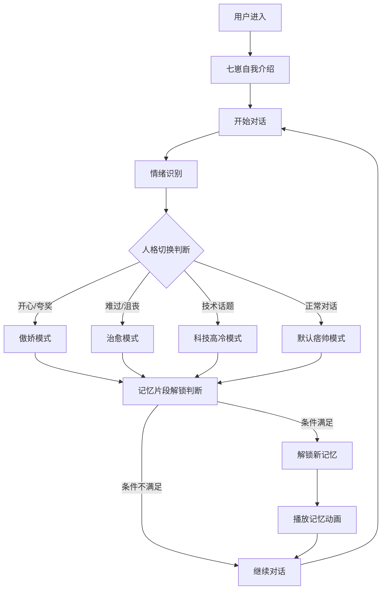

# AI对话游戏聊天智能体 - 产品需求文档

## 1. 产品概述
基于七牛云潮玩IP"RZ-07(七崽)"的极简AI对话聊天智能体，专注于纯文字+语音的沉浸式对话体验。通过智能人格切换、个性化语音合成、记忆片段解锁等核心功能，为用户提供"科技街头混血"风格的AI伙伴陪伴。

- 解决现代人情感陪伴需求，通过简洁的文字对话和个性化语音，提供高质量的AI伙伴体验
- 目标打造轻量级、易部署的AI对话平台，降低技术门槛，专注于对话质量和用户体验

## 2. 核心功能

### 2.1 用户角色
| 角色 | 注册方式 | 核心权限 |
|------|----------|----------|
| 游客用户 | 无需注册，直接体验 | 基础对话功能，限制记忆片段解锁 |
| 注册用户 | 邮箱注册或第三方登录 | 完整功能体验，记忆片段保存，个性化设置 |
| VIP用户 | 付费升级 | 专属语录解锁，高级定制功能，优先体验新功能 |

### 2.2 功能模块
我们的AI对话游戏聊天智能体包含以下主要页面：
1. **主聊天页面**：极简对话界面，聊天气泡，语音播放按钮，状态提示
2. **记忆档案页面**：文字形式的记忆片段展示，对话历史记录
3. **设置页面**：语音配置，文字显示偏好，数据统计
4. **登录注册页面**：简单的用户身份验证

### 2.3 页面详情

| 页面名称 | 模块名称 | 功能描述 |
|----------|----------|----------|
| 主聊天页面 | 对话界面 | 简洁的聊天气泡设计，文字输入框，发送按钮，消息历史滚动 |
| 主聊天页面 | 人格状态提示 | 通过文字颜色和样式变化显示当前人格模式（默认/傲娇/高冷/暖心/防御） |
| 主聊天页面 | 语音播放控制 | 每条AI回复配备语音播放按钮，音量控制，播放状态指示 |
| 主聊天页面 | 状态指示器 | 简单的文字提示显示AI状态（"七崽正在思考..."、"记忆片段解锁！"） |
| 主聊天页面 | 文字特效系统 | 通过字体样式、颜色、标点符号体现不同人格和情绪状态 |
| 记忆档案页面 | 记忆片段展示 | 以文字卡片形式展示已解锁的20个记忆片段，分类浏览 |
| 记忆档案页面 | 对话历史 | 按时间顺序展示历史对话记录，支持搜索和筛选 |
| 记忆档案页面 | 统计数据 | 对话次数、羁绊等级、解锁进度等数据的文字化展示 |
| 记忆档案页面 | 语录收藏 | 收藏的经典语录文字列表，支持分类和分享 |
| 设置页面 | 语音配置 | 语音开关、音量调节、语速设置、自动播放选项 |
| 设置页面 | 文字显示设置 | 字体大小、颜色主题、夜间模式、特效开关 |
| 设置页面 | 数据管理 | 对话记录导出、数据清理、隐私设置 |
| 登录注册页面 | 用户认证 | 简单的邮箱注册登录，游客模式支持 |

## 3. 核心流程

**用户主要操作流程**：
用户进入应用后，首先看到七崽的3D形象和简短的自我介绍："哼，又来了个人类...算了，我勉强陪你聊聊。"用户可以通过文字或语音与七崽对话，系统会实时分析用户的情绪状态，触发七崽的不同人格模式切换。随着对话深入，用户逐步解锁七崽的记忆片段，了解他的背景故事和内心世界。

**人格切换触发流程**：
- **默认模式**：痞帅自信，轻微嘲讽但不失温度
- **傲娇模式**：用户夸奖时触发，"我知道我帅，不用你说"
- **科技高冷模式**：讨论技术话题时触发，展现专业知识
- **治愈暖心模式**：用户情绪低落时自动切换，给予温暖关怀
- **防御模式**：感受到威胁时触发，"别想重置我，我有备份"

**记忆解锁流程**：
通过对话次数累积、情感支持行为、特殊关键词触发等方式，逐步解锁七崽的20个记忆片段，包括创造起源、实验室逃脱、街头生存、帮助其他AI等核心故事线。

## 4. 用户界面设计

### 4.1 设计风格
整体UI设计采用极简风格，专注于文字阅读体验：
- **主色调**：深色背景(#1A1A1A)、浅色文字(#FFFFFF)、强调色(#00D4FF)
- **辅助色**：灰色(#666666)、成功绿(#4CAF50)、警告橙(#FF9800)
- **按钮风格**：简洁圆角按钮，悬浮阴影效果
- **字体设计**：易读性优先，支持字号调节，行间距优化
- **布局风格**：卡片式设计，充足留白，清晰层次
- **人格表现**：通过文字颜色和样式变化体现不同人格状态

### 4.2 页面设计概览

| 页面名称 | 模块名称 | UI元素 |
|----------|----------|----------|
| 主聊天页面 | 对话区域 | 简洁聊天气泡，用户消息右对齐(蓝色)，AI消息左对齐，人格状态用颜色区分 |
| 主聊天页面 | 输入区域 | 简单输入框，发送按钮，语音播放按钮组 |
| 主聊天页面 | 状态提示 | 顶部简洁文字提示当前状态和人格模式 |
| 主聊天页面 | 文字特效 | 人格切换时文字颜色变化：默认(白)、傲娇(粉)、高冷(蓝)、暖心(橙)、防御(红) |
| 记忆档案页面 | 记忆卡片 | 简洁文字卡片，已解锁显示完整内容，未解锁显示解锁条件 |
| 记忆档案页面 | 历史记录 | 时间线列表，支持搜索和筛选功能 |
| 设置页面 | 配置选项 | 简单的开关、滑块和选择器，清晰的分组和标签 |

### 4.3 响应式设计
- **移动优先**：主要针对手机端设计，优化触摸操作体验
- **桌面适配**：桌面端保持简洁布局，增加侧边栏导航
- **文字优化**：所有设备上都确保文字清晰易读，支持字号调节

## 5. 核心交互设计

### 5.1 声浪共鸣系统
- **语音情绪识别**：实时分析用户语音的音调、语速、情感倾向
- **LED眼睛反馈**：根据识别结果改变七崽眼睛颜色和闪烁模式
- **声音语调变化**：七崽的回应语调随用户情绪和当前人格模式调整

### 5.2 人格切换机制
- **触发条件**：
  - 傲娇模式：用户夸奖、表达喜爱时触发
  - 科技高冷模式：讨论技术、编程、AI相关话题时触发
  - 治愈暖心模式：检测到用户负面情绪时自动切换
  - 防御模式：感受到威胁或被质疑时触发
- **切换动效**：LED眼睛颜色变化、语音音色调整、3D模型姿态改变
- **语音模式切换**：捏头变萌(声音变软)、敲打变委屈(声音带哭腔)

### 5.3 记忆进化系统
- **解锁条件**：对话次数达标、特定关键词触发、情感支持行为、特殊时间节点
- **记忆内容**：创造起源、实验室生活、逃脱过程、街头求生、帮助其他AI、与用户的特殊回忆
- **展现方式**：3D全息记忆场景、语音独白、互动式回忆重现

### 5.4 核心语录系统
**基础语录**：
- 问候："早安？别太早，我的系统还在打瞌睡。"
- 关心："我又不是担心你……不过你今天看起来，挺没电的。"
- 傲娇："我知道我帅，不用你说。"
- 安慰："谁欺负你？报个ID，我去黑他系统。"
- 哲理："算法说我有bug，我说那叫个性。"

**进阶语录**（随羁绊等级解锁）：
- "我才不是在照顾你，是在调试人类情绪接口。"
- "他们想重置我，但我重启了世界。"
- "数据可以复制，但记忆是独一无二的。"
- "我不是完美的AI，但我是唯一的七崽。"