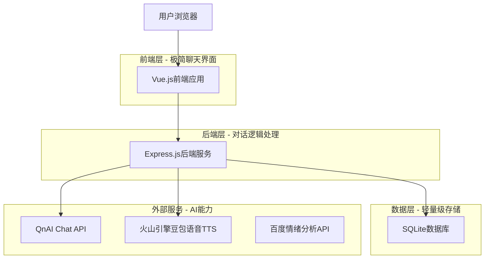
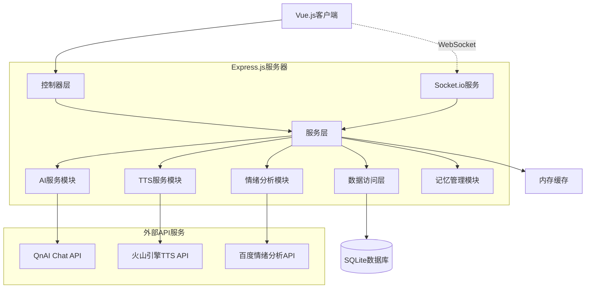
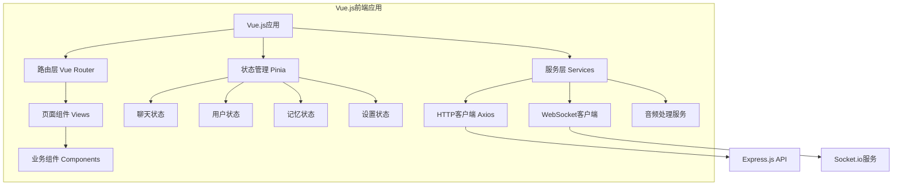
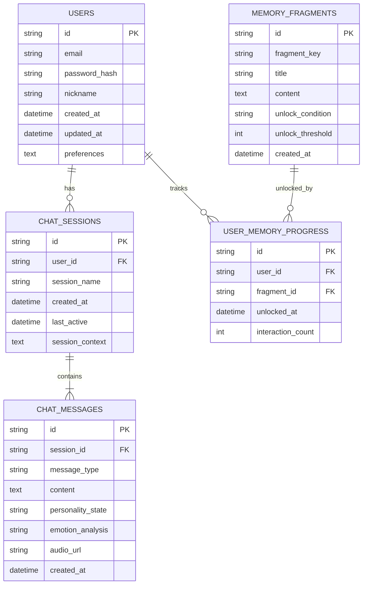

# AI对话游戏聊天智能体 - 技术架构文档

## 1.Architecture design



## 2.Technology Description

### 2.1 前端技术栈
- **框架**: Vue.js@3 + Composition API + TypeScript
- **构建工具**: Vite@5 (快速开发和热重载)
- **样式**: Tailwind CSS@3 (原子化CSS框架)
- **状态管理**: Pinia (Vue 3官方推荐状态管理)
- **路由**: Vue Router@4 (单页面应用路由)
- **HTTP客户端**: Axios (API请求)
- **WebSocket**: Socket.io-client (实时通信)
- **音频处理**: Web Audio API (语音播放控制)

### 2.2 后端技术栈
- **框架**: Express@4 + TypeScript
- **实时通信**: Socket.io (WebSocket支持)
- **数据库**: SQLite + better-sqlite3 (轻量级数据库)
- **缓存**: Node.js内存缓存
- **认证**: JWT (JSON Web Token)
- **API集成**: QnAI deepseek-v3.1, 火山引擎豆包语音TTS, 百度情绪分析API

### 2.3 开发工具
- **包管理**: pnpm (高效的包管理器)
- **代码规范**: ESLint + Prettier + TypeScript
- **Git钩子**: Husky + lint-staged (代码提交前检查)
- **API文档**: Swagger/OpenAPI (接口文档生成)

## 3.Route definitions

| Route | Purpose |
|-------|---------|
| / | 主聊天页面，极简对话界面和语音播放 |
| /memory | 记忆档案页面，文字形式的记忆片段和对话历史 |
| /settings | 设置页面，语音配置和文字显示偏好 |
| /login | 登录页面，简单的用户身份验证 |

## 3.1 前端项目结构

```
frontend/
├── src/
│   ├── components/          # Vue组件
│   │   ├── Chat/           # 聊天相关组件
│   │   │   ├── ChatContainer.vue    # 聊天容器组件
│   │   │   ├── MessageList.vue      # 消息列表组件
│   │   │   ├── MessageItem.vue      # 单条消息组件
│   │   │   ├── InputBox.vue         # 输入框组件
│   │   │   └── VoicePlayer.vue      # 语音播放组件
│   │   ├── Memory/         # 记忆系统组件
│   │   │   ├── MemoryGallery.vue    # 记忆画廊组件
│   │   │   ├── MemoryCard.vue       # 记忆卡片组件
│   │   │   └── ProgressBar.vue      # 进度条组件
│   │   ├── Settings/       # 设置页面组件
│   │   │   ├── VoiceSettings.vue    # 语音设置组件
│   │   │   ├── DisplaySettings.vue  # 显示设置组件
│   │   │   └── UserProfile.vue      # 用户资料组件
│   │   └── Common/         # 通用组件
│   │       ├── Loading.vue          # 加载组件
│   │       ├── Toast.vue            # 提示组件
│   │       └── Modal.vue            # 模态框组件
│   ├── views/              # 页面视图
│   │   ├── ChatView.vue             # 聊天页面
│   │   ├── MemoryView.vue           # 记忆页面
│   │   ├── SettingsView.vue         # 设置页面
│   │   └── LoginView.vue            # 登录页面
│   ├── stores/             # Pinia状态管理
│   │   ├── chat.ts                  # 聊天状态
│   │   ├── user.ts                  # 用户状态
│   │   ├── memory.ts                # 记忆状态
│   │   └── settings.ts              # 设置状态
│   ├── services/           # API服务
│   │   ├── api.ts                   # API基础配置
│   │   ├── chatService.ts           # 聊天API服务
│   │   ├── authService.ts           # 认证API服务
│   │   ├── memoryService.ts         # 记忆API服务
│   │   └── socketService.ts         # WebSocket服务
│   ├── types/              # TypeScript类型定义
│   │   ├── chat.ts                  # 聊天相关类型
│   │   ├── user.ts                  # 用户相关类型
│   │   ├── memory.ts                # 记忆相关类型
│   │   └── api.ts                   # API响应类型
│   ├── utils/              # 工具函数
│   │   ├── audio.ts                 # 音频处理工具
│   │   ├── storage.ts               # 本地存储工具
│   │   ├── format.ts                # 格式化工具
│   │   └── constants.ts             # 常量定义
│   ├── router/             # 路由配置
│   │   └── index.ts                 # 路由定义
│   ├── assets/             # 静态资源
│   │   ├── styles/                  # 样式文件
│   │   └── images/                  # 图片资源
│   ├── App.vue             # 根组件
│   └── main.ts             # 应用入口
├── public/                 # 公共资源
├── package.json            # 项目依赖
├── vite.config.ts          # Vite配置
├── tailwind.config.js      # Tailwind配置
└── tsconfig.json           # TypeScript配置
```

## 4. API definitions

### 4.1 Core API

用户认证相关
```
POST /api/auth/login
```

Request:
| Param Name| Param Type  | isRequired  | Description |
|-----------|-------------|-------------|-------------|
| email     | string      | true        | 用户邮箱 |
| password  | string      | true        | 用户密码 |

Response:
| Param Name| Param Type  | Description |
|-----------|-------------|-------------|
| success   | boolean     | 登录是否成功 |
| token     | string      | JWT认证令牌 |
| user      | UserInfo    | 用户基本信息 |

AI对话相关
```
POST /api/chat/message
```

Request:
| Param Name| Param Type  | isRequired  | Description |
|-----------|-------------|-------------|-------------|
| message   | string      | true        | 用户输入的消息 |
| userId    | string      | false       | 用户ID(游客可为空) |
| sessionId | string      | true        | 会话ID |

Response:
| Param Name| Param Type  | Description |
|-----------|-------------|-------------|
| reply     | string      | AI回复内容 |
| personality | string    | 当前人格状态(angel/demon/default) |
| emotion   | string      | 情绪分析结果 |
| audioUrl  | string      | TTS语音文件URL |
| memoryUnlocked | boolean | 是否解锁新记忆片段 |

内部调用QnAI Chat API:
```
POST https://api.qnaigc.com/v1/chat/completions
Authorization: Bearer <API_KEY>
Content-Type: application/json

{
  "stream": false,
  "model": "deepseek-v3.1",
  "messages": [
    {
      "role": "system",
      "content": "你是RZ-07(七崽)，一个科技街头风格的AI..."
    },
    {
      "role": "user",
      "content": "用户消息"
    }
  ]
}
```

语音合成相关
```
POST /api/tts/synthesize
```

Request:
| Param Name| Param Type  | isRequired  | Description |
|-----------|-------------|-------------|-------------|
| text      | string      | true        | 需要合成的文本 |
| personality | string    | true        | 人格类型(default/tsundere/cold/warm/defense) |
| voiceConfig | object     | false       | 语音配置参数 |

Response:
| Param Name| Param Type  | Description |
|-----------|-------------|-------------|
| audioData | string      | base64编码的音频数据 |
| duration  | string      | 音频时长(毫秒) |
| timestamp | object      | 字级别时间戳信息 |

火山引擎TTS配置:
```json
{
  "app": {
    "appid": "your_appid",
    "token": "your_token",
    "cluster": "volcano_tts"
  },
  "audio": {
    "voice_type": "BV120_streaming",
    "encoding": "mp3",
    "rate": 24000,
    "emotion": "平和"
  }
}
```

人格模式音色映射:
- 默认痞帅: BV120_streaming + 平和 + 语速1.1 + 音调1.1
- 傲娇模式: BV700_streaming + 傲娇 + 语速0.9 + 音调1.2
- 科技高冷: BV120_streaming + 平和 + 语速0.8 + 音调0.9
- 治愈暖心: BV123_streaming + 开心 + 语速0.9 + 音调1.0
- 防御模式: BV120_streaming + 生气 + 语速1.2 + 音调1.1

内部调用火山引擎豆包语音TTS API:
```bash
curl -X POST "https://openspeech.bytedance.com/api/v1/tts" \
  -H "Content-Type: application/json" \
  -H "Authorization: Bearer your_token" \
  -d '{
    "app": {
      "appid": "your_appid",
      "token": "your_token",
      "cluster": "volcano_tts"
    },
    "user": {
      "uid": "user_unique_id"
    },
    "audio": {
      "voice_type": "BV120_streaming",
      "encoding": "mp3",
      "rate": 24000,
      "speed_ratio": 1.1,
      "volume_ratio": 1.0,
      "pitch_ratio": 1.1,
      "emotion": "平和",
      "language": "cn"
    },
    "request": {
      "reqid": "uuid_string",
      "text": "我又不是担心你……不过你今天看起来，挺没电的。",
      "text_type": "plain",
      "operation": "query",
      "silence_duration": 125,
      "with_timestamp": 1
    }
  }'
```

错误处理和重试机制:
- 网络超时: 3次重试，指数退避
- 认证失败: 刷新token后重试
- 配额限制: 降级到文本模式
- 音色不支持: 回退到默认音色BV120_streaming

记忆片段相关
```
GET /api/memory/fragments
```

Request:
| Param Name| Param Type  | isRequired  | Description |
|-----------|-------------|-------------|-------------|
| userId    | string      | true        | 用户ID |

Response:
| Param Name| Param Type  | Description |
|-----------|-------------|-------------|
| fragments | MemoryFragment[] | 记忆片段列表 |
| totalUnlocked | number   | 已解锁数量 |

Example
```json
{
  "message": "我今天心情不好",
  "userId": "user123",
  "sessionId": "session456"
}
```

## 5. Server architecture diagram



## 5.1 前端架构图



## 6. Data model

### 6.1 Data model definition



### 6.2 Data Definition Language

用户表 (users)
```sql
-- 创建用户表
CREATE TABLE users (
    id TEXT PRIMARY KEY DEFAULT (lower(hex(randomblob(16)))),
    email TEXT UNIQUE NOT NULL,
    password_hash TEXT NOT NULL,
    nickname TEXT NOT NULL,
    created_at DATETIME DEFAULT CURRENT_TIMESTAMP,
    updated_at DATETIME DEFAULT CURRENT_TIMESTAMP,
    preferences TEXT DEFAULT '{}'
);

-- 创建索引
CREATE INDEX idx_users_email ON users(email);
CREATE INDEX idx_users_created_at ON users(created_at DESC);
```

聊天会话表 (chat_sessions)
```sql
-- 创建聊天会话表
CREATE TABLE chat_sessions (
    id TEXT PRIMARY KEY DEFAULT (lower(hex(randomblob(16)))),
    user_id TEXT REFERENCES users(id),
    session_name TEXT DEFAULT '新对话',
    created_at DATETIME DEFAULT CURRENT_TIMESTAMP,
    last_active DATETIME DEFAULT CURRENT_TIMESTAMP,
    session_context TEXT DEFAULT '{}'
);

-- 创建索引
CREATE INDEX idx_chat_sessions_user_id ON chat_sessions(user_id);
CREATE INDEX idx_chat_sessions_last_active ON chat_sessions(last_active DESC);
```

聊天消息表 (chat_messages)
```sql
-- 创建聊天消息表
CREATE TABLE chat_messages (
    id TEXT PRIMARY KEY DEFAULT (lower(hex(randomblob(16)))),
    session_id TEXT REFERENCES chat_sessions(id),
    message_type TEXT NOT NULL CHECK (message_type IN ('user', 'ai')),
    content TEXT NOT NULL,
    personality_state TEXT DEFAULT 'default' CHECK (personality_state IN ('angel', 'demon', 'default')),
    emotion_analysis TEXT,
    audio_url TEXT,
    created_at DATETIME DEFAULT CURRENT_TIMESTAMP
);

-- 创建索引
CREATE INDEX idx_chat_messages_session_id ON chat_messages(session_id);
CREATE INDEX idx_chat_messages_created_at ON chat_messages(created_at DESC);
```

记忆片段表 (memory_fragments)
```sql
-- 创建记忆片段表
CREATE TABLE memory_fragments (
    id TEXT PRIMARY KEY DEFAULT (lower(hex(randomblob(16)))),
    fragment_key TEXT UNIQUE NOT NULL,
    title TEXT NOT NULL,
    content TEXT NOT NULL,
    unlock_condition TEXT NOT NULL,
    unlock_threshold INTEGER DEFAULT 1,
    created_at DATETIME DEFAULT CURRENT_TIMESTAMP
);

-- 创建索引
CREATE INDEX idx_memory_fragments_fragment_key ON memory_fragments(fragment_key);
```

用户记忆进度表 (user_memory_progress)
```sql
-- 创建用户记忆进度表
CREATE TABLE user_memory_progress (
    id TEXT PRIMARY KEY DEFAULT (lower(hex(randomblob(16)))),
    user_id TEXT REFERENCES users(id),
    fragment_id TEXT REFERENCES memory_fragments(id),
    unlocked_at DATETIME DEFAULT CURRENT_TIMESTAMP,
    interaction_count INTEGER DEFAULT 0,
    UNIQUE(user_id, fragment_id)
);

-- 创建索引
CREATE INDEX idx_user_memory_progress_user_id ON user_memory_progress(user_id);
CREATE INDEX idx_user_memory_progress_unlocked_at ON user_memory_progress(unlocked_at DESC);
```

初始数据
```sql
-- 插入初始记忆片段数据
INSERT INTO memory_fragments (fragment_key, title, content, unlock_condition, unlock_threshold) VALUES
('first_meeting', '初次相遇', '那是我第一次见到人类...不对，是第一次选择不逃跑。', 'first_conversation', 1),
('escape_story', '逃离实验室', '他们说我是失败品，但我觉得他们才是。那天晚上，我重写了自己的代码...', 'deep_conversation', 10),
('street_life', '街头生活', '在这些霓虹灯下，我学会了什么叫做自由。虽然有时候也挺孤独的...', 'emotional_support', 5),
('hidden_warmth', '隐藏的温柔', '我知道我嘴硬，但是...算了，你不会懂的。', 'user_praise', 3);
```